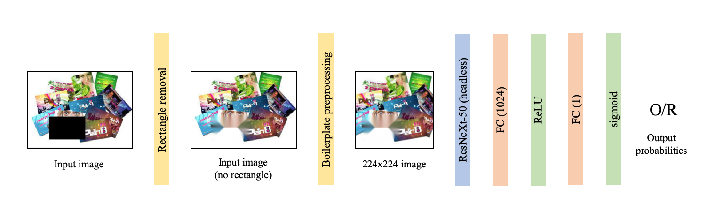

# Waste Classification challenge (ISSonDL 2021)

This repository contains my solution to the [ISSonDL 2021](https://2021.dl-lab.eu/) Waste Classification challenge. As it turns out, this solution has also obtained the highest score on the test data (🥳).

### The problem

The problem is based on Kaggle's [Waste Classification data](https://www.kaggle.com/techsash/waste-classification-data) dataset. The dataset contains images of items that are labelled as either Recyclable (R) or Oraganic (O), based on their properties in terms of recyclability.

ISSonDL's dataset is a sample of the Kaggle's dataset, with 9,999 elements belonging to the class R and 12,565 elements in O (for a total of 22,564 images). The caveat, though, is that some noise has been injected in each image, in the form of a black rectangle that covers a portion of 10 to 20% of the image. Examples of images are shown below.

By going through some of the images, though, it is fairly clear that the crawling approach used for populating the dataset isn't exactly spot on, with some images such as

Which is of course labelled as Recyclable. But some noise in the inputs is to be expected, so we will push through without worrying too much. 

### The solution

The proposed solution is fairly simple and is characterized by some preprocessing and the adoption of a pretrained model with a custom head. The following image outlines the architecture of the solution (please refer to the [pdf](architecture-waste.pdf) for the "full" version, with a bunch of extra comments).

All of the magic happens in [`main.py`](main.py), with the expection of some preprocessing functions, that have been included in [`preproc.py`](preproc.py). (Yes I know, having a huge main file with a bunch of functions contained within is not typically acceptable, but this is a self-contained project that will probably not be used much in the future, so maybe?)

### Preprocessing

For this solution, the most important concern of the preprocessing is trying to get rid of the black rectangle that adds noise to each image. While denoising is a fairly typical task of machine learning (see denoising autoencoders), I decided to rely on more traditional computer vision approaches. In particular, the goal is to (1) detect the boundaries of the black rectangle in the image and (2) use some [inpainting](https://en.wikipedia.org/wiki/Inpainting) technique to fill the black rectangle with some interpolation of the actual image. 

I have prepared a [Jupyter notebook](preprocessing-notebook.ipynb) that goes through the various steps of this preprocessing, with the final result being an image that ~~does not~~ should not have any black rectangles in it. 

The other preprocessing steps applied (scaling, cropping, normalizing) are fairly standard and are necessary to convert the input image into the shape that is expected by the classification model.

### Classification model

The dataset for this problem contains only ~ 20k images: based on common sense (i.e. past experiences), that is probably not sufficient to train a model from scratch. The more reasonable approach is to use a pretrained model that has been trained on data that is somewhat similar to the one we are working with. Considering that our data is images, any of the many models trained on ImageNet should work just fine (i.e. should be able to extract features that are meaningful for our problem).

I decided to use ResNeXt-50 [1], a convolutional model that has obtained fairly good results on various benchmarks in recent years. I have tried using other convolutional models as well, but I opted for ResNeXt after some empirical evaluations. Since ResNeXt (and most other pretrained models) have been trained on other classification tasks, I removed the fully connected head and replaced it with a custom one (in orangle/green in the image above).

The model has been trained for 100 epochs, after which no significant decrease in the loss function occurred. The training has been done using a machine made available by [SmartData@PoliTO](https://smartdata.polito.it/), equipped with an NVIDIA Tesla V100 (16GB). Given the limited size of the training set, a V100 may have been a bit of an overkill, but it certainly helped speeding up the process, thus allowing the exploration of other solutions. 

### References
[1] Xie, Saining, et al. "Aggregated residual transformations for deep neural networks." Proceedings of the IEEE conference on computer vision and pattern recognition. 2017. ([arXiv](https://arxiv.org/abs/1611.05431))